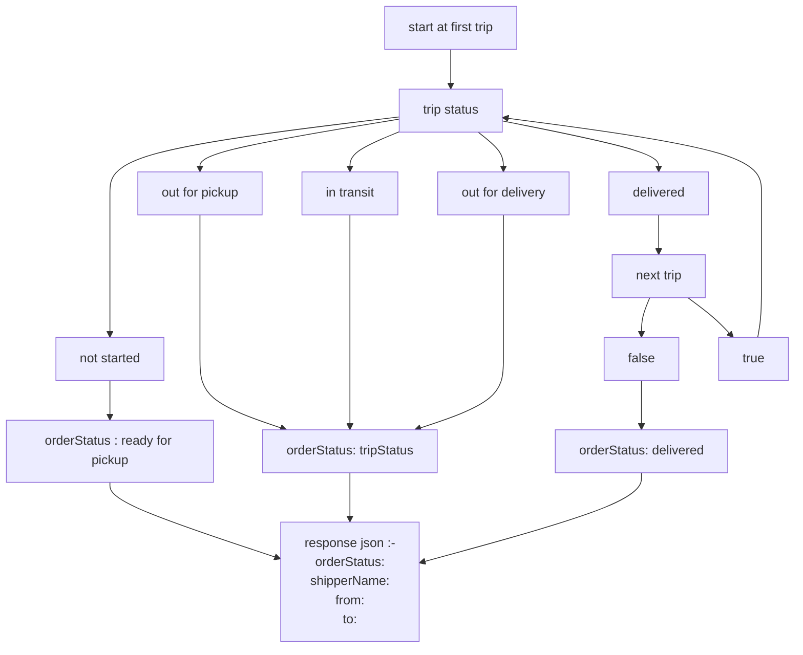

```mermaid
flowchart TB
    it[start at first trip] -->ct
    ct[trip status] --> ns[not started] & op & itr & od & d
    op[out for pickup] ----> os
    itr[in transit] ----> os
    od[out for delivery] ----> os
    d[delivered] --> c[next trip]
    ns --> st1[orderStatus : ready for pickup]
    os[orderStatus: tripStatus] --> f
    st1 --> f[response json :- \norderStatus: \nshipperName: \nfrom:\nto: ]
    c --> false --> m[orderStatus: delivered] --> f
    c --> true  --> ct
```
