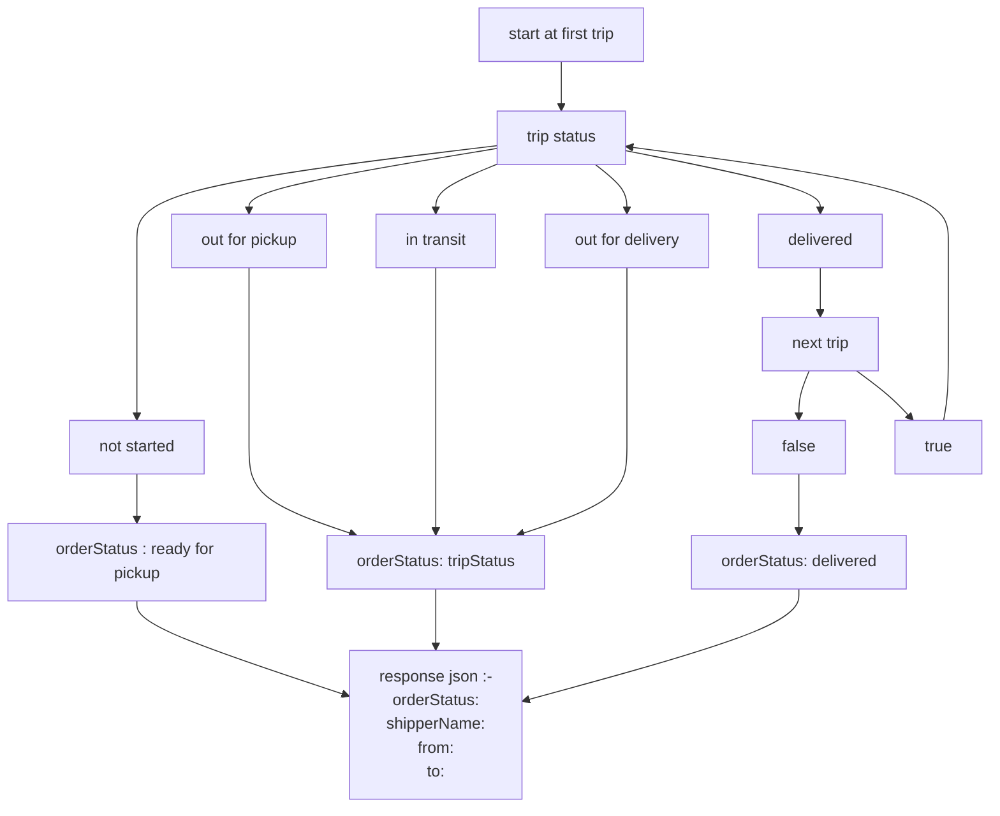

# order

live deployment on render :

baseUrl: https://order-service-6zhy.onrender.com

# API to create an order

`baseUr/api/orders`

It is done using the post method (to '/api/orders') of the express libray while passing the order json as body in request object

# Api to get status

`baseUr/api/orders/status/:id`

It is done using get method (to '/api/orders/status/:id' ) of the express library while passing the id as paramater

it uses the following algorithm to get the status of an order based on the 'trips' property

# Demonstration of APIs using postman

<video src='"C:\Sameer\videos\31.03.2023_17.32.52_REC.mp4"' width=180></video>
